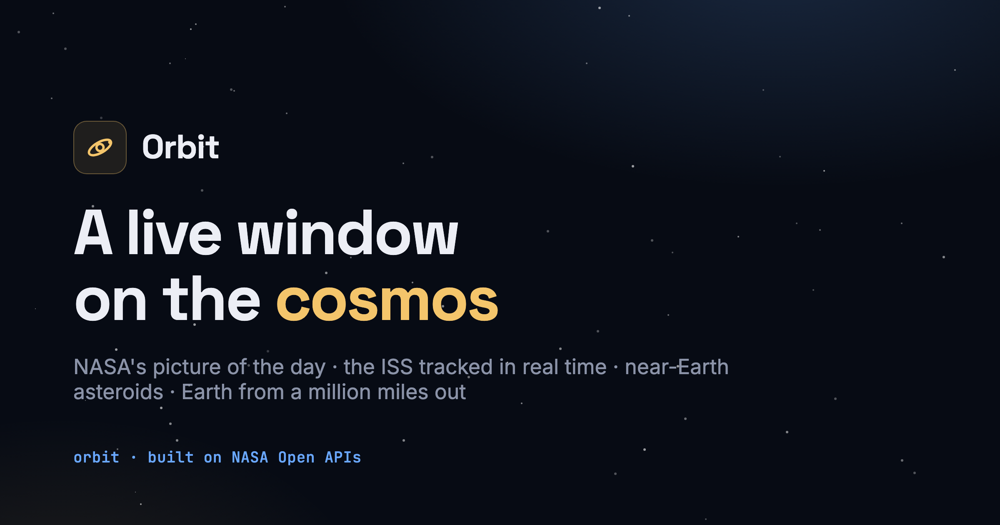
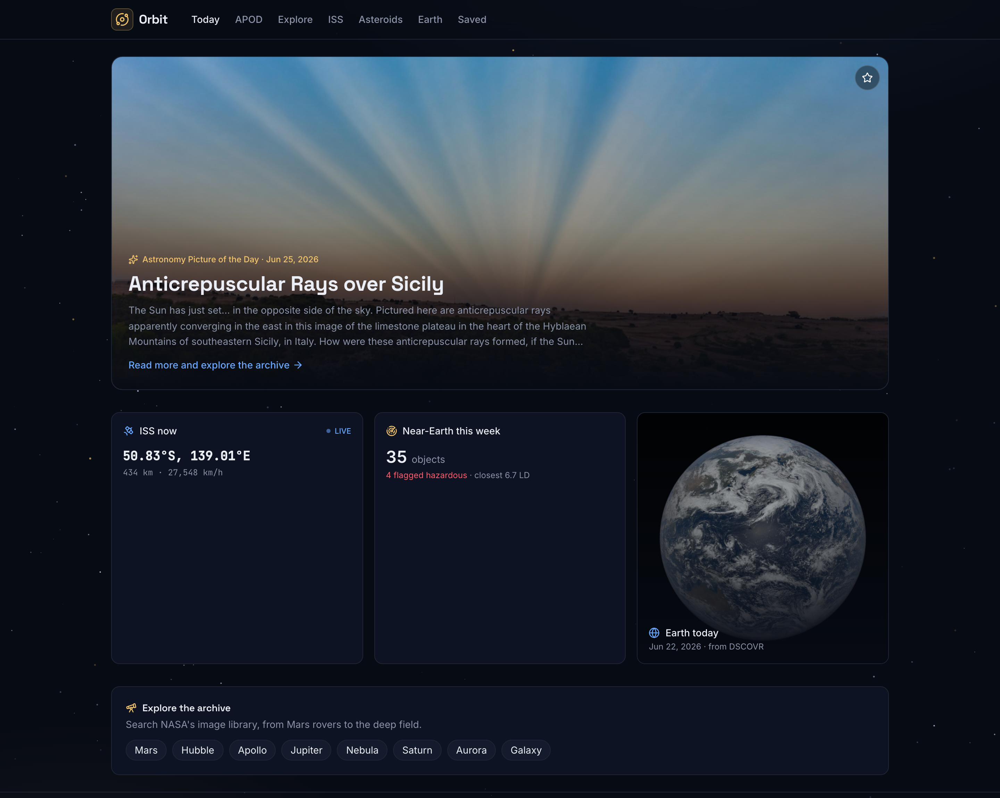
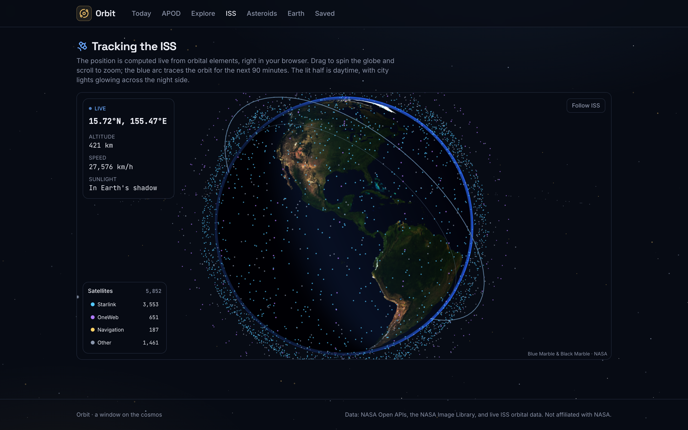
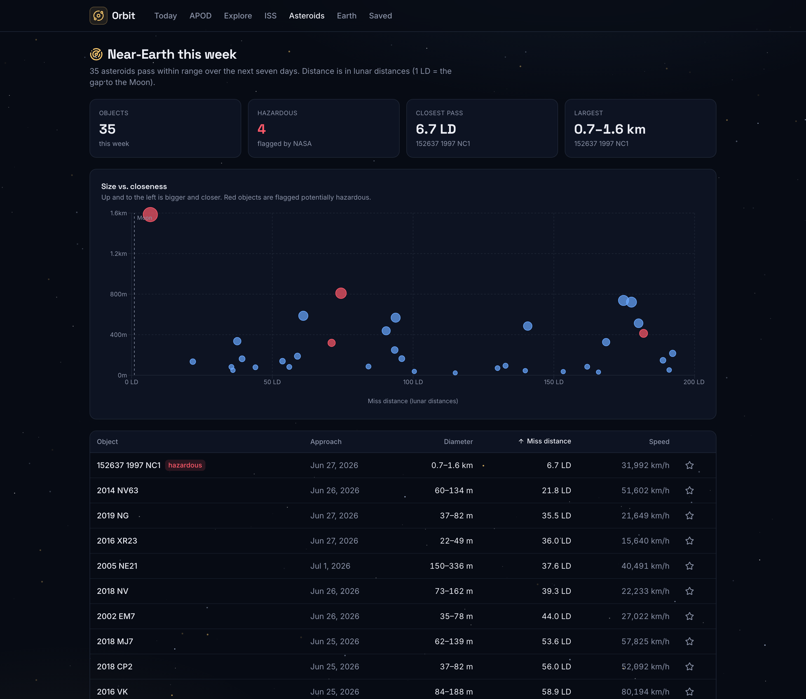
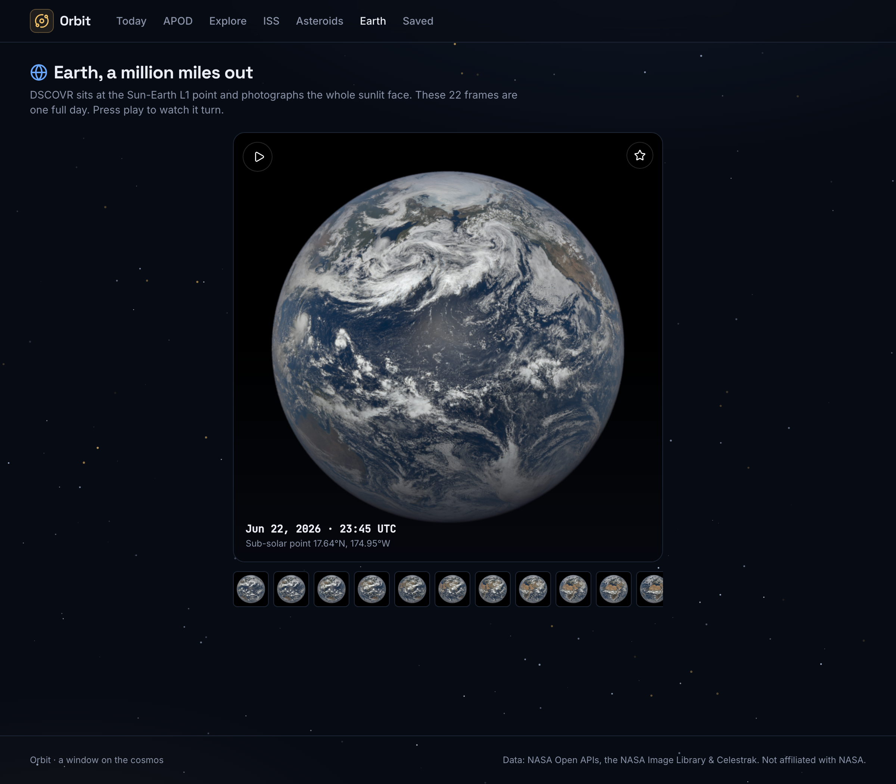

# Orbit

**A live window on the cosmos.** NASA's picture of the day, the ISS tracked in real time from
orbital elements, near-Earth asteroids framed against the distance to the Moon, a searchable slice
of NASA's image archive, and Earth photographed from a million miles away. No login, no setup,
just open it.



🌐 **Live:** **[orbit-torj.vercel.app](https://orbit-torj.vercel.app)** · Built with React 19, Spring Boot 3, and the NASA Open APIs.

---

## What's inside

| View | What it does |
|---|---|
| **Today** | The astronomy picture of the day as a full-bleed hero, the ISS's live position, this week's asteroid count, and the latest Earth disk. One glance, the whole sky. |
| **Picture of the Day** | The full archive back to June 1995. Step a day at a time, jump to any date, roll the dice, watch the videos, grab the HD file. |
| **Explore** | Search the NASA Image and Video Library. Sixty results a page, a focused lightbox, save anything. |
| **ISS** | The station on a real 3D globe you can spin and zoom: a photoreal Earth with the live day/night terminator and glowing city lights, the ISS on its orbit, and a live shell of ~5,800 tracked satellites (Starlink, OneWeb, navigation and more) propagated right in your browser, colour-coded with toggles and counts. No polling. |
| **Asteroids** | Every near-Earth object this week, plotted by size against how close it passes (in lunar distances, with the Moon marked for scale), plus a sortable table. |
| **Earth** | DSCOVR's full-disk images from the Sun-Earth L1 point. Press play and watch a whole day of rotation. |
| **Saved** | Everything you starred, kept on your device, no account required. |

<p align="center">
  
  
</p>
<p align="center">
  
  
</p>

## A few decisions worth explaining

**The browser never sees the API key.** The Spring Boot app is a backend-for-frontend. It holds the
single `NASA_API_KEY`, calls NASA, caches the responses, and hands the React app exactly the shape it
needs. Every image the browser loads comes from a keyless host (`images-assets.nasa.gov`,
`epic.gsfc.nasa.gov`, `apod.nasa.gov`), so the key stays server-side even though the imagery is
client-rendered.

**The ISS moves smoothly without hammering anything.** Live-position APIs are rate-limited and jumpy.
Instead the backend fetches the station's orbital elements (a TLE) once, caches them for six hours, and
the browser propagates the actual position with [satellite.js](https://github.com/shashwatak/satellite-js),
deriving the ground track and the day/night terminator locally. The marker glides instead of teleporting,
with no polling and no rate limits. (Two lessons paid for here: satellite.js v4 not v5, whose WASM build
breaks the bundler; and not Celestrak for the TLE, because it silently drops connections from datacenter
IPs, so it works on a laptop but never from a cloud host. The provider uses a cloud-friendly source with
a fallback.)

**The world is a real globe, not a flat map.** The ISS view renders with
[react-three-fiber](https://github.com/pmndrs/react-three-fiber): a textured sphere (NASA's public-domain
Blue Marble by day, Black Marble city lights by night), a GLSL shader that paints the day/night terminator
from the live sub-solar point, an atmospheric rim-glow, and the orbit traced in 3D. The same browser-side
propagation drives it, and it falls back to the flat 2D map on any browser that can't do WebGL.

**Thousands of satellites, propagated in your browser without dropping a frame.** The globe carries a
live shell of ~5,800 tracked objects (a baked snapshot of Celestrak's active catalogue). Every one of
them is propagated from its orbital elements in a Web Worker, off the main thread, which streams packed
positions back to a GPU point cloud each tick. The render stays smooth, no live API is needed, and the
shell is colour-coded by constellation with per-category toggles and live counts.

**An AI flight director that narrates the sky and steers the globe.** Press "Brief me on the sky" and the
backend gathers the live picture (the ISS position, today's NASA picture, this week's asteroids), asks
Google Gemini for a short spoken "state of the sky", and streams it back token-by-token over Server-Sent
Events. The narration types itself out and carries invisible control tags (`[[focus:iss]]`,
`[[highlight:starlink]]`), so as it speaks the camera flies to the station and a constellation lights up
while the rest dim. The API key never leaves the server, and with no key set it falls back to an
equally-grounded, templated narration, so the feature works (and demos) for free.

**NASA's thumbnails are a trap, so the backend untangles them.** The image search returns one
thumbnail URL per result, except the size is inconsistent. Some are 50 KB, some are the 26 MB original.
The provider rewrites every URL to a known-good variant: `~thumb` (about 50 KB) for the grid and
`~medium` (about 160 KB) for the lightbox. The grid stays fast and the detail view stays crisp.

**Earth rotates without downloading 70 MB.** The EPIC view animates a full day of Earth, 22 frames.
Loading 22 full-resolution disks would be brutal, so while it's spinning it cycles the 7 KB
thumbnails, then snaps to the sharp 3 MB disk the instant you pause.

**Asteroids get real scale.** A table of miss distances in kilometres means nothing to most people.
Orbit plots each object by diameter against miss distance in *lunar distances* and draws a line at the
Moon's orbit, so "this one passes inside the Moon" reads instantly.

**Favorites without accounts.** The first visit mints a UUID into `localStorage`. Every favorite is
keyed by that id and persisted in Postgres. No login, but your collection follows you back.

## Stack

- **Frontend:** React 19, TypeScript, Vite, Tailwind v4, TanStack Query, React Router, Recharts,
  three.js / react-three-fiber, react-leaflet, framer-motion, satellite.js.
- **Backend:** Spring Boot 3.5 / Java 21, a `RestClient`-based provider layer, Caffeine caching with
  per-endpoint TTLs, light Resilience4j retries, Spring Data JPA, springdoc OpenAPI, and SSE streaming
  for the AI narration.
- **Data:** H2 locally, Postgres in production. NASA Open APIs (APOD, NeoWs, EPIC, Image Library) and
  a cloud-friendly TLE service (with a fallback) for the ISS elements. The satellite swarm is a baked
  snapshot of Celestrak's active catalogue, refreshed by a script. The flight director streams from
  Google Gemini (optional; a grounded fallback runs without a key).
- **Tests:** JUnit + WireMock + MockMvc on the backend, Vitest + Testing Library on the frontend,
  GitHub Actions for both.

```
Browser (Vercel)  ──HTTPS──>  Spring Boot BFF (Render)  ──>  NASA Open APIs + TLE feed
   │  satellite.js                 │  owns NASA_API_KEY
   │  computes ISS live            │  caches responses (Caffeine)
   └──────────────────────────────┴──>  Postgres (Neon) for anonymous favorites
```

## Run it locally

```bash
# Backend → http://localhost:8080  (Swagger UI at /swagger-ui.html)
cd backend
NASA_API_KEY=your_key ./mvnw spring-boot:run

# Frontend → http://localhost:5173
cd frontend
npm install
npm run dev
```

A free NASA key takes about a minute: https://api.nasa.gov/. `DEMO_KEY` works for a first look but is
rate-limited to ~30 requests an hour. The frontend proxies `/api` to the backend in dev, so no CORS
setup is needed.

## Tests

```bash
cd backend  && ./mvnw test     # providers (WireMock), favorites API (MockMvc + H2)
cd frontend && npm run test    # formatting + components (Vitest)
```

## Deploy

The frontend is a static SPA for Vercel. The backend ships as a container (`backend/Dockerfile`) to
Render via `render.yaml`, with Postgres on Neon. Set on the backend: `NASA_API_KEY`, `DATABASE_URL`
(plus username and password), and `CORS_ORIGINS` (your web origin). Optionally set `GEMINI_API_KEY`
to power the AI flight director with live Gemini narration; without it the endpoint serves a grounded
templated narration instead. Set on the frontend: `VITE_API_BASE_URL` pointing at the backend.
In-memory caching is used in production, so there is no Redis to run.

## Notes

Imagery and data are courtesy of NASA and are in the public domain. Orbit is an independent project
and is not affiliated with or endorsed by NASA.
